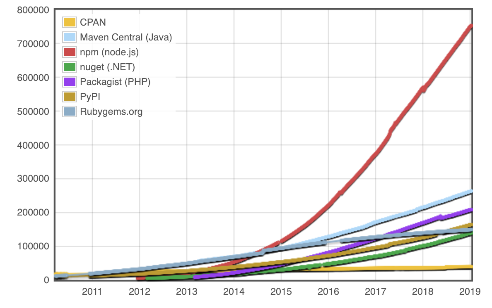

# Fyrirlestur 2.1 — Einingar

## Vefforritun 2 — HBV403G

### Ólafur Sverrir Kjartansson, [osk@hi.is](mailto:osk@hi.is)

---

## npm

* npm er _pakkastjóri_ (package manager) fyrir JavaScript
  - leyfir okkur líka að setja upp og nota allskonar tól sem skrifuð eru með JavaScript
* Sett upp með _[node.js](https://nodejs.org/)_

***

## Pakkastjóri

* Pakkastjóri sér um að sjálfvirknivæða það að setja upp, stilla og fjarlægja hugbúnað
  - í staðinn fyrir að þurfa að sækja einhvern hugbúnað...
  - finna hvert við sóttum hann...
  - keyra eitthvað uppsetningarforrit...
  - síðan keyra forritið

***

* Keyrum í staðin eina skipun og höfum aðgang að forriti
* Vistar einnig _hvaða_ forrit verkefni notar svo aðrir geta sótt

***

* Hellingur til af npm módúlum/pökkum sem geta einfaldað okkur lífið
* Sækjum með npm og tilgreinum þannig að forritið okkar þarfnist þessa pakka
  - Skilgreinum _dependency_ á pakkann
  - Vistað í `package.json` ásamt útgáfunúmeri

***

## npm pakkar

[](http://www.modulecounts.com/)

***

## npm install `<module>`

* Skipun til að setja upp `<module>` einingu eftir nafni
* npm byrjar á að athuga hver er nýjasta útgáfa af `<module>`, ef einhver
* Sækir útgáfuna

***

* Sækir alla pakka sem `<module>` þarf (og pakka sem þeir pakka þurfa o.s.fr.)
* Geymir alla pakka eins útflatta og hægt er í `/node_modules`
  - Geymum þessa möppu **ekki** í source control
* Útbýr `package-lock.json` með upplýsingum um alla pakka sem sóttir voru

***


***

## Útgáfunúmer

npm notar [_semantic versioning_](https://semver.org/) (semver) til að tilgreina útgáfunúmer á forminu `major.minor.patch`, t.d. `1.2.3`

***

* `major` er hækkað ef við gerum breytingar sem brjóta API, t.d. breytum nafni á falli
* `minor` er hækkað ef við bætum við virkni án þess að brjóta (backwards compatible)
* `patch` er hækkað ef við lögum villur án þess að brjóta (backwards compatible)

***

## Hvaða útgáfu má npm installa?

* npm tilgreinir útgáfunúmer með _caret_ fyrir framan, t.d. `^1.2.3`
  - Sættum okkur við útgáfur sem hækka ekki fyrsta ekki-0 tölustaf lengst til vinstri, t.d. `^1.2.3` leyfir útgáfu `1.9.3` en ekki `2.0.0`
* Getum líka tilgreint _nákvæma_ útgáfu með `1.2.3`
* og fleiri flóknari reglur, sjá [the semantic versioner for npm](https://docs.npmjs.com/misc/semver)

***

## Hættur þess að leyfa uppfærslur

* Hugbúnaður er (ennþá!) skrifaður af fólki og fólk gerir mistök
* Að leyfa uppfærslur þegar npm sækir pakka _getur brotið forritin okkar_, þó það sé _bara_ minor útgáfa
* Góð regla að skilgreina nákvæmar útgáfur og uppfæra meðvitað

***

## package-lock.json

* `package-lock.json` skilgreinir nákvæmar útgáfur af öllum pökkum sem við notum og pökkum sem þeir pakkar nota
* Leyfir öðrum að fá _nákvæmlega_ sömu útgáfu af keyrslu umhverfi og sá sem skrifaði
* Geymum því í source control

***

## npm ókostir?

* En hefur npm ókosti?
* Seinustu ár hafa komið upp atvik þar sem pakkar hafa horfið úr npm og haft áhrif á _þúsundir_ verkefna
* Getur verið varasamt að taka á sig of mörg dependancy

---

## Einingar

* Getum og _ættum að_ skipta forritunum okkar upp í einingar
* Með því verður...
  - auðveldara er að hugsa um forritið
  - auðveldara að vinna með _flækjustig_

***

* Node.js kemur með nokkrum einingum
  - Getum sótt aðrar gegnum npm
  - Eða skrifað okkar eigin

***

## Einingar í Node.js

* Einingakerfið í Node.js byggir á [CommonJS](http://www.commonjs.org/specs/modules/1.0/)
  - Varð til þegar fólk fór að nota JavaScript utan vafra og þurfti leið til að pakka saman virkni
  - Hleður einingum _synchronously_
* Snýst um að _exporta_ gögnum úr einingum og sækja með `require`

***

## module.exports

* Til að veita aðgang að virkni í einingu þurfum við að _exporta_ einhverju
* Gerum það með því að skilgreina hvaða gildi sem er á `module.exports`

***

* `module.exports = 1;` – Gildinu `1` er skilað úr module
* `module.exports = () => {};` – falli skilað
* `module.exports = { foo: 'bar' };` – hlut skilað

[Node.js: Modules](https://nodejs.org/api/modules.html)

***

## Kóða skipt upp

* Nokkrar leiðir til að skipta upp í módúla:
  - Stakt skjal, t.d. `app.js`
  - Mappa með virkni, inngangspunktur er skrá nefnd `index.js` innan hennar
  - Mappa með virkni, inngangspunktur skilgreindur í `package.json` undir `main` lykli

***

## require

* Notum pakka með
  - `const pakki = require('<pakki>');`
* Ef engin ending er skilgreind er gert ráð fyrir að skrá innihaldi JavaScript
* Ef ending er `json` eru json gögn í skrá þáttuð og þeim skilað

***

node.js mun leita eftir reglu:

* Ef strengur pakka byrjar á `./`, `/` eða `../` er leitað
  - `./` – í sömu möppu og skrá er í
  - `/` – eftir nákvæmlega uppgefinni slóð
  - `../` – í möppu fyrir ofan núverandi möppu
* Annars er leitað `/node_modules` í núverandi möppu, síðan fyrir ofan og koll af kolli

***

## import og export

* ECMAScript 2015 skilgreinir aðra leið með _import_ og _export_
  - Almennt ekki kominn nógu góður stuðningur
* Node.js hefur _experimental_ stuðning ef við keyrum
  - `node --experimental-modules file.mjs`
  - Skrár verða að hafa endinguna `mjs` til að geta notað

***

* Flókið því _import_ _export_ hleður einingum _asynchronously_
* Node.js getur ekki vitað hvernig gögnum er exportað úr skrá nema við merkjum sérstaklega

***

```javascript
export default {
  foo: 'hello world',
};

export const bar = 'foo bar';
```

<!-- eslint-disable import/no-unresolved, no-unused-vars -->

```javascript
// default export
import foo from './export';
```

<!-- eslint-disable import/no-unresolved, no-unused-vars -->

```javascript
// named export
import { bar, bar as baz } from './export';
```

***

* Skýrari syntax
* Nefnd export
* Stutt af Babel, Webpack, Rollup o.fl, en þar er að einhverju leiti svindlað og öllu hlaðið synchronously
* Munum sjá þegar við förum í React

---

## Publisha á npm

* Þegar við höfum skrifað frábær forrit sem vel er hægt að endurnýta er auðvelt að koma því á npm
  - Búa til notanda á npm
  - Skilgreina `name` og `version` í `package.json`
  - Keyra [`npm publish`](https://docs.npmjs.com/getting-started/publishing-npm-packages)
  - Gróði!

---

## Skjölun eininga

* JSDoc er ein til að skjala JavaScript kóða
  - Svipar til JavaDoc
* Margar leiðir til að merkja kóða
  - http://usejsdoc.org/
* Gott að nota frekar en að búa eitthvað til sjálf

***

<!-- eslint-disable no-unused-vars -->

```javascript
/**
 * Read a file.
 *
 * @param {string} path - Path to file
 * @returns {Promise} Promise with file content
 */
function readFile(path) {
  // ...
}
```

***

* [`jsdoc`](https://github.com/jsdoc3/jsdoc) á npm útbýr skjölun útfrá JSDoc
* `npm install -g jsdoc`
* `jsdoc app.js`
