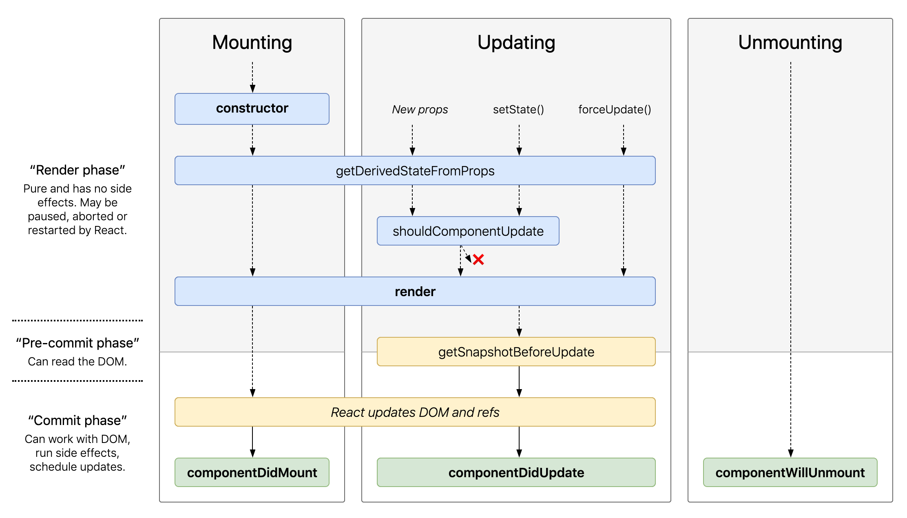

# Fyrirlestur 9.1

## React

### Vefforritun 2 — HBV403G

#### Ólafur Sverrir Kjartansson, [osk@hi.is](mailto:osk@hi.is)

---

## Búum til klukku

Hvernig búum við til klukku í React?

```javascript
function tick() {
  const element = (
    <p>{new Date().toLocaleTimeString()}</p>
  );
  ReactDOM.render(
    element,
    document.getElementById('root')
  );
}
setInterval(tick, 1000);
```

***

## Aðskiljum klukku frá render

```javascript
function Clock(props) {
  return (
    <p>{props.date.toLocaleTimeString()}</p>
  );
}
function tick() {
  ReactDOM.render(
    <Clock date={new Date()} />,
    document.getElementById('root')
  );
}
setInterval(tick, 1000);
```

***

## Þetta er ekki endurnýtanlegt

* Viljum að klukkan sjái sjálf um stöðu sína
* Útfærslu atriði hvort við notum `setInterval` eða eitthvað annað
* Þurfum `state` fyrir component

***

```javascript
class Clock extends React.Component {
  state = { date: new Date() }

  render() {
    return (
      <p>
        {this.state.date.toLocaleTimeString()}
      </p>
    );
  }
}
```

Léleg klukka, hún uppfærist ekki...

---

## Lifecycle methods

* Lifecycle methods eru það sem við notum til að bregðast við breytingum á „lífi“ component
  - Er búið að búa component til í DOM? Er verið að fjarlægja hann? Var component að fá ný prop?
* Leyfir okkur að keyra kóða og gera uppfærslur á stöðu eða skila upplýsingum um component á hverjum tímapunkti

***



***

## constructor

* Kallað í fyrst þegar component er mountað
  - Mountað – búin til DOM element úr react elementi
* Þurfum ekki nema við:
  - Setjum byrjunar `state`
  - Bindum event handlera
  - Séum að gera eitthvað flóknara

***

```javascript
constructor(props) {
  super(props);
  // Don't call this.setState() here!
  this.state = { counter: 0 };
  this.handleClick = this.handleClick.bind(this);
}
```

***

## componentDidMount

* `componentDidMount` keyrir þegar búið er að búa til DOM element og bæta við
* Getum brugðist við með því að búa til timera, sækja gögn o.þ.h.
* Keyrir _aðeins_ á client

***

## componentWillUnmount

* `componentWillUnmount` keyrir áður en element verður fjarlægt úr DOM
* Hreinsum til eftir okkur, fjarlægjum timers og event handlers ef einhverjir

***

```javascript
componentDidMount() {
  this.timerID = setInterval(
    () => this.tick(),
    1000
  );
}
componentWillUnmount() {
  clearInterval(this.timerID);
}
tick() {
  this.setState({
    date: new Date()
  });
}
```

***

## getDerivedStateFromProps

* `getDerivedStateFromProps(props, state)`
* Kallað í rétt áður en kallað er í `render`, bæði í fyrsta skipti og fyrir hvert þaðan í frá
* Tækifæri til að breyta `state` út frá `props`
* [Þurfum yfirleitt ekki](https://reactjs.org/blog/2018/06/07/you-probably-dont-need-derived-state.html), ættum að skoða aðrar leiðir fyrst
  - Blæs út kóða og eykur líkur á villum

***

## shouldComponentUpdate

* `shouldComponentUpdate(nextProps, nextState)` er leið fyrir okkur til að tilgreina hvort component eigi að uppfærast og þar með rendera aftur
* Lang oftast viljum við ekki eiga við þetta
* Ef við eigum við er það til að koma í veg fyrir að dýr component sé renderaður of oft

***

## render

* Eina fallið sem við verðum að útfæra
* Skilgreinir hvernig við birtum component út frá `props` og `state`
* Ætti að vera hreint fall—skila alltaf sömu niðurstöðum fyrir sama inntak og breytir ekki `state`

***

## getSnapshotBeforeUpdate

* `getSnapshotBeforeUpdate(prevProps, prevState)`
* Kallað í áður en breytingar úr render er komið fyrir í DOM tré
* Skilar gildi sem við getum notað í `componentDidUpdate`
  - Ekki mikið notað, notað t.d. til að eiga við scroll stöðu

***

## componentDidUpdate

* `componentDidUpdate(prevProps, prevState, snapshot)`
* Kallað eftir að búið er að uppfæra DOM
  - Ekki kallað í eftir fyrsta `render`

***

* Notum til að gera breytingar út frá DOM eftir að búið er að uppfæra
* Getum kallað í `setState()` en verðum að hafa conditional sem athugar `props`
  - Fáum annars óendanlega lykkju

***

```javascript
componentDidUpdate(prevProps) {
  //Typical usage (don't forget to compare props):
  if (this.props.userID !== prevProps.userID) {
    this.fetchData(this.props.userID);
  }
}
```

***

## PureComponent

* Ef við höfum einfaldan component getum við látið hann erfa frá `React.PureComponent` í staðinn fyrir `React.Component`
* Útfærir `shouldComponentUpdate` sem _shallow_ samanburð á `props` og `state`

***

* Ætti því aðeins að nota ef við höfum ekki _complex_ týpur (`array`, `object`)
  - Mun skila `true` ef rekst á þannig og græðum þá ekkert

***

## Önnur lifecycle methods

* Hafa verið fleiri lifecycle methods sem búið er að fjarlægja eða deprecatea
  - `componentWillMount`, `componentWillUpdate` o.fl.
* Fjarlægð til að einfalda API
* Ennþá aðgengileg með `UNSAFE_` prefix
  - `UNSAFE_componentWillMount`
* Ættum ekki að nota

***


---

## Klukka

* Getum núna notað
  - `componentDidMount` til að útbúa timer sem uppfærir klukku
  - `componentWillUnmount` til að fjarlægja timer þegar klukka er fjarlægð úr DOM
* Haldið utan um `state` og allt sem component þarf innan hans
  - Highly cohesive & loosely coupled

---

## Ajax

* Að sækja gögn er ekki ósvipað því sem við höfum nú þegar gert með `fetch`
* Getum notað `async await` með CRA
  - Köllum yfirleitt í gögn úr `componentDidMount` svo við merkjum það sem `async`

***

## Stöður á gögnum

* Ættum að meðhöndla þrjár stöður:
  - `loading`, verið að sækja gögn
  - `error`, eitthvað kom upp við að sækja gögn
  - `success`, gögn sótt og birt

***

```javascript
class Fetch extends Component {
  state = { data:null, loading:true, error:false }
  async componentDidMount() {
    try {
      const data = await this.fetchData();
      this.setState({ data, loading: false });
    } catch (e) {
      this.setState({ error:true,loading:false });
    }
  }
  async fetchData() {
    const response = await fetch(url);
    return await response.json();
  }
```

***

```javascript
  render() {
    const { data, loading, error } = this.state;

    if (loading) {
      return (<div>Sæki gögn...</div>);
    }

    if (error) {
      return (<div>Villa við að sækja gögn</div>);
    }

    return (<div>Gögn: {data}</div>);
  }
}
```

---

## Form í react

* Form element sjá um sitt eigið state:
  - Ef við sláum inn staf í `<input>` heldur það utan um stafinn og alla sem fylgja
* Passar ekki við `state` í react, viljum að einhver react component haldi utan um stöðu

***

* Getum stjórnað stöðu í react með því að binda fall við form element og geyma stöðu þess í `state`
  - React verður „single source of truth“
  - „Controlled component“
* Ef við höldum ekki utan um stöðu í react erum við að nota _uncontrolled component_

***

```javascript
class NameForm extends React.Component {
  state = { value: '' }

  handleChange = (e) => {
    this.setState({value: e.target.value});
  }

  handleSubmit = (e) => {
    e.preventDefault();
    alert(this.state.value);
  }

  render() {
    return (
    <form onSubmit={this.handleSubmit}>
      <input
        type="text"
        value={this.state.value}
        onChange={this.handleChange} />
      <input type="submit" value="Submit" />
    </form>
    );
  }
}
```

***

* `handleChange` keyrir fyrir _hvern_ innslátt í `<input>`
* Töluvert öðruvísi en án react
  - Þurfum ekki að lesa gildi úr reit á einhverjum tímapunkti
  - Vitum alltaf stöðu og getum stoppað strax ef t.d. ekki valid gögn

***

## textarea

* Efni í `<textarea>` er skilgreint af börnum þess en í react fær það `value` attribute
* `<textarea value={this.state.value} onChange={this.handleChange} />`

***

## select

* Sama með `<select>`, valið `<option>` er skilgreint sem `value` á `<select>`
* Getum valið mörg með `<select multiple={true} value={['B', 'C']}>`
* Þetta samræmir API á `<input>`, `<textarea>` og `<select>`

***

```javascript
render() {
  return (
    <form onSubmit={this.handleSubmit}>
      <select
        value={this.state.value}
        onChange={this.handleChange}
      >
        <option value="foo">Foo</option>
        <option value="bar">Bar</option>
      </select>
      <input type="submit" value="Submit" />
    </form>
  );
}
```

***

## Margir reitir

* Þegar við höfum marga reiti í sama formi getur kóði farið úr böndunum
* Getum nýtt okkur `name` attribute á reit til að gera almennan handler
  - Fyrir sérstaka virkni getum við síðan alltaf skrifað spes

***

```javascript
handleInputChange(event) {
  const target = event.target;
  const value = target.type === 'checkbox' ?
    target.checked : target.value;
  const name = target.name;
  this.setState({ [name]: value });
}
return (
  <input type="text"
    name="foo"
    value={this.state.foo}
    onChange={this.handleInputChange}
  />
);
```
